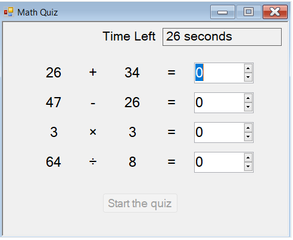

# dev-in-house-math-quiz

Um app simples com um quiz de matemática para mostrar o básico do windows forms para a turma do dev-in-house.

Basedo nesse tutorial ofcial da Microsoft:
https://docs.microsoft.com/pt-br/visualstudio/get-started/csharp/tutorial-windows-forms-math-quiz-create-project-add-controls?view=vs-2022